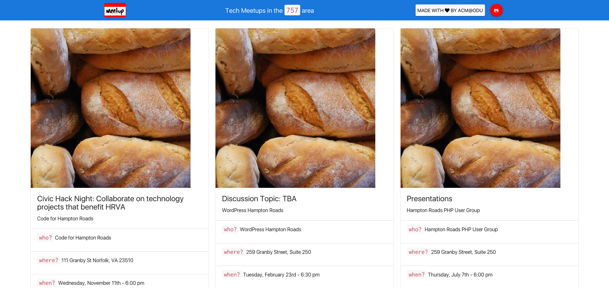

# Tech Meetups Nearby

> We showcase **tech-related** meetups from the `757` area using a custom API & <a href="http://meetup.com" target="_blank">Meetup.com</a>

## Head on over to <a href="http://oduacm.github.io/meetups-nearby" target="_blank">`oduacm.github.io/meetups-nearby`</a> to check it out! :smile:

  

---

## Contributing

To contribute to this project, there are **3 simple steps**:

- **Step 1**

🍴 **Fork** this repo!

- **Step 2**

🔨 Make some **awesome changes** (add new features, optimize code, etc.)!

- **Step 3**

🔃 Create a **pull request**!

---

## Team

### Developers

|  | 
| :---: |:---:| :---:|
| <a href="http://github.com/aag1091" target="_blank">`aag1091`</a> |  <a href="http://github.com/joshuajharris" target="_blank">`joshuajharris`</a>

### Designer

|  |
| :---: |
| <a href="http://github.com/fvcproductions" target="_blank">`fvcproductions`</a> |

---

## Donations

### Help the designer feed herself via PayPal.

